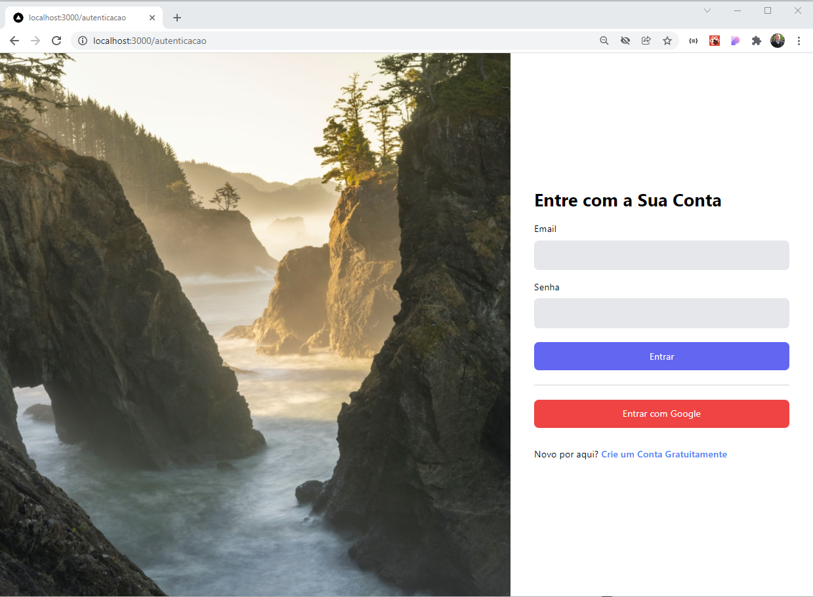
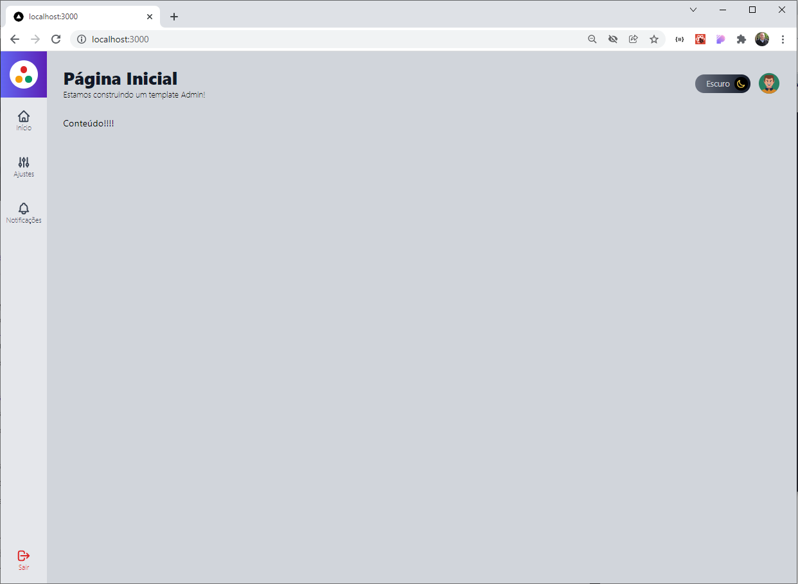
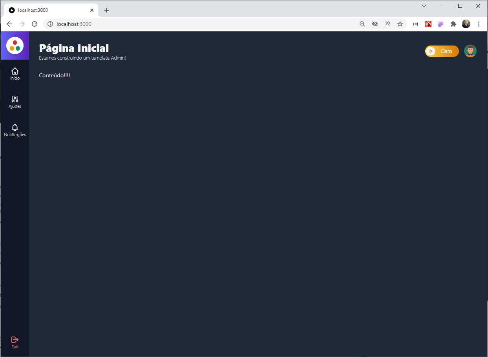

Template desenvolvido em **Nextjs** com **TypeScript** inteiramente componentizado. Para o css foi utilizado tailwind e para cadastro de logins login com firebase.

  
Curso Udemy - Next.js e React: Template - Full Stack Next JS

  
Instrutor - Leonardo Moura Leitao

  

### Layout do projeto

Tela Principal -  login.

  

Navegação da tela em modo light.

  

Navegação da tela em modo dark.

  

  <small>Sandro - 2022</small>

